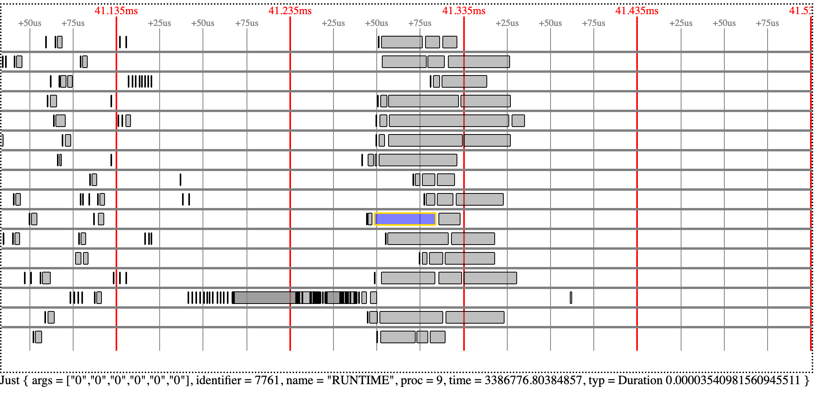

# viz

A simple visualizer for parallel execution traces, based on HTML and SVG.
Written in [Elm](https://elm-lang.org/).
It's a work-in-progress, but already somewhat usable.



## Use it

1. Install [Elm](https://elm-lang.org/)
1. Do `make`. This generates `index.html`.
1. Open `index.html` in your browser.
1. Click on the `select file` button at the top, and open a trace file (e.g.
[example-traces/small.txt](example-traces/small.txt)).
1. Use the **up** and **down** keys to zoom in and out, and **left** and **right**
to navigate. Horizontal scrolling also works.
1. Hover your mouse over an event to see information about that event at the
bottom.

## Trace Format

A trace file is a sequence of events, in no particular order, with one event on
each line. An event is a comma-separated row with the following form:
```
<LABEL>[_ENTER|_LEAVE],<PROC>,<TIME>,<ARG1>,<ARG2>,<ARG3>
```

  - `<LABEL>` is the name of the event. Choose anything that is meaningful.
  There are two types of events:
    - *Momentary* events, which occur at some moment in time. For example,
    "processor 0 wrote to location X" could be a reasonable momentary event.
    - *Duration* events, which begin at some moment and end at another.
    These are identified by pairs of events whose labels end in `_ENTER` and
    `_LEAVE`. For each `<LABEL>_ENTER`, the next `<LABEL>_LEAVE` that appears on
    the same processor will be used as the end of that event. Note that
    duration events can overlap.
  - `<PROC>` is a number (0 through N-1 for N processors) identifying the
  processor that logged the event.
  - `<TIME>` is the time of the event, in seconds. These times do not have to
  start at 0; everything will be listed relative to the earliest time that
  appears in the trace.
  - `<ARG1>`,`<ARG2>`, and `<ARG3>` can be anything useful that you would like
  to additionally include in the event.
